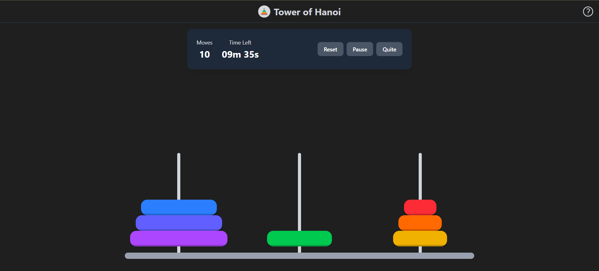

# 🏯 Tower of Hanoi


Tower of Hanoi is a game that implements the classic **"Tower of Hanoi"** puzzle. The player moves disks between three pegs, following the rule: a larger disk cannot be placed on top of a smaller one. It supports difficulty level customization, a timer, a scoring system, and a scoreboard.

---

## 📑 Table of Contents

- [Features](#-features)
- [Project Structure](#-project-structure)
- [Getting Started](#-getting-started)
- [Available Commands](#-available-commands)
- [Configuration](#-configuration)
- [License](#-license)
- [Author](#-author)

---

## ✨ Features

- **Difficulty level customization** - add as many rings to the game as you see fit
- **Timer** - time limit depending on the chosen difficulty
- **Scoreboard** - player statistics saved in `localStorage`
- **Game statistics** - move count, efficiency, and time tracking
- **Responsive UI** - the game works great on any screen size

---

## 📁 Project Structure

```
hanoi-tower/
├── docs/                    # Documentation
├── src/
│   ├── assets/              # Images and media resources
│   ├── components/
│   │   ├── common/          # Reusable UI components (Button, Card, etc.)
│   │   ├── game/            # Game logic components (Disk, Tower, HanoiGame, etc.)
│   │   └── layout/          # Page layout components
│   ├── constants/           # Game constants and difficulty configuration
│   ├── hooks/               # Custom React hooks (useGame, useTimer, etc.)
│   ├── pages/               # Application pages (Start, Game, Scoreboard, Score, etc.)
│   ├── stores/              # Zustand stores (game settings, game state, results)
│   ├── types/               # TypeScript types and interfaces
│   ├── utils/               # Utility helpers (time formatting, etc.)
│   ├── App.tsx              # Root component with routing
│   ├── main.tsx             # Entry point
│   └── index.css            # Global styles
├── eslint.config.js         # ESLint configuration
├── tsconfig.json            # Base TypeScript configuration
├── tsconfig.app.json        # TS configuration for source code (src/)
├── tsconfig.node.json       # TS configuration for Node files (vite.config.ts)
├── vite.config.ts           # Vite configuration
├── package.json             # Dependencies and scripts
└── index.html               # HTML entry point
```

---

## 🚀 Getting Started

### Prerequisites

- **Node.js** ≥ 18
- **npm package manager**

### Installation

```bash
# Clone the repository
git clone <repository-url>
cd hanoitower

# Install dependencies
npm install
```

### Running in Development Mode

```bash
npm run dev
```

The application will be available at the address shown in the terminal (usually `http://localhost:5173`).

---

## 📜 Available Commands

| Command             | Description                                                 |
| ------------------- | ----------------------------------------------------------- |
| `npm run dev`       | Start the Vite development server with HMR                  |
| `npm run build`     | TypeScript type checking and production build                |
| `npm run preview`   | Local preview of the production build                        |
| `npm run lint`      | Run ESLint to check code quality                             |

---

## ⚙ Configuration

### Vite (`vite.config.ts`)

The project bundler. Uses the following plugins:
- `@vitejs/plugin-react` - plugin for React support
- `@tailwindcss/vite` - Tailwind CSS integration

### TypeScript

The configuration is split into three files:
- **`tsconfig.json`** - base file that references two child configs
- **`tsconfig.app.json`** - TypeScript settings for the client-side React application (`src/`)
- **`tsconfig.node.json`** - TypeScript settings for the Node part of the project (`vite.config.ts`)

### ESLint (`eslint.config.js`)

Linter for maintaining code quality. Applied rule sets:
- `@eslint/js` - recommended base rules
- `typescript-eslint` - TypeScript rules
- `eslint-plugin-react-hooks` - React hooks rules validation
- `eslint-plugin-react-refresh` - Vite HMR compatibility

The `dist/` directory is ignored.

### Tailwind CSS

Version 4 with built-in integration via the Vite plugin. Styles are imported in `src/index.css`.

---

## 📄 License
This project is licensed under the MIT License.

Licensing details are provided in the [LICENSE](./LICENSE) file.

A full dependency license report is available in [LICENSE_REPORT.md](./LICENSE_REPORT.md)

---

## 👤 Author

**Denys Linevych**